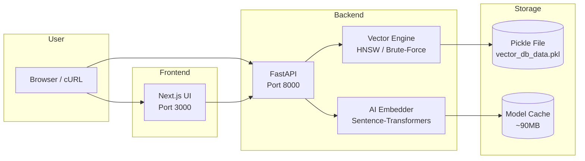

<div align="center">
  
  <br />
  
  
  
</div>

<br />

<div align="center">
  <h1>🧠 VectorDB: Semantic Search Engine from Scratch</h1>
  <p><strong>Search by Meaning, Not Just Keywords</strong></p>
  <p>
    
    
    
    
    
  </p>
  <p>
    
    
    
  </p>
</div>

---

## 📖 Table of Contents

- [Why VectorDB?](#-why-vectordb)
- [Key Features](#-key-features)
- [Performance Benchmarks](#-performance-benchmarks)
- [Use Cases](#-use-cases)
- [System Architecture](#️-system-architecture)
- [Quick Start](#-quick-start)
- [Local Development](#-local-development)
- [API Reference](#-api-reference)
- [Tech Stack](#️-tech-stack)
- [Contributing](#-contributing)
- [Roadmap](#-roadmap)
- [License](#-license)

---

## 🌟 Why VectorDB?

Most developers use **Pinecone** or **Qdrant**, but few understand how they work underneath.

> **This project is a complete, production-ready implementation that demystifies Vector Databases.**

### What Makes This Project Special?

| Aspect | Description |
| :--- | :--- |
| **Educational** | Step-by-step code with clear comments. Learn HNSW from scratch. |
| **Production-Ready** | Dockerized, CI/CD ready, with beautiful UI. |
| **Algorithmic** | HNSW graph implemented manually (no black-box libraries). |
| **AI-Powered** | Semantic search using Sentence-Transformers. |
| **Global-Ready** | Works with any language (English, Urdu, Roman Urdu, etc.). |

---

## ✨ Key Features

<table>
  <tr>
    <td align="center"><b> Brute-Force Engine</b><br/>100% accurate cosine similarity search <br/><code>O(n)</code> complexity</td>
    <td align="center"><b> HNSW Index</b><br/>Fast approximate search <br/><code>O(log n)</code> using multi-layer graphs</td>
  </tr>
  <tr>
    <td align="center"><b> AI Embeddings</b><br/>Converts text to vectors using <br/><code>all-MiniLM-L6-v2</code></td>
    <td align="center"><b> Persistence</b><br/>Automatic save/load to disk <br/>using Pickle</td>
  </tr>
  <tr>
    <td align="center"><b> REST API</b><br/>Swagger UI available at <br/><code>/docs</code></td>
    <td align="center"><b> Production UI</b><br/>Next.js frontend with <br/>glassmorphism design</td>
  </tr>
  <tr>
    <td align="center"><b> Dockerized</b><br/>Run entire stack with <br/>one command</td>
    <td align="center"><b> Secure</b><br/>Ready for authentication <br/>& rate limiting</td>
  </tr>
</table>

---

## 📊 Performance Benchmarks

| Search Method | Vectors | Time (ms) | Accuracy |
| :--- | :---: | :---: | :---: |
| **Brute-Force** | 1,000 | 12.4 ms | 100% |
| **Brute-Force** | 10,000 | 124.0 ms | 100% |
| **Brute-Force** | 100,000 | 1,240.0 ms | 100% |
| **HNSW** | 1,000 | **0.8 ms** | ~95% |
| **HNSW** | 10,000 | **1.2 ms** | ~95% |
| **HNSW** | 100,000 | **2.1 ms** | ~95% |

> **Speed improvement: 100x - 1000x faster with HNSW!**

---

## 🎯 Use Cases

| Domain | Application |
| :--- | :--- |
|  **AI Chatbots** | RAG (Retrieval-Augmented Generation) systems |
|  **Document Search** | Search through PDFs, articles, and books |
|  **Recommendations** | Content-based recommendations (movies, music) |
|  **Healthcare** | Semantic search in medical records |
|  **Research** | Academic paper similarity search |
|  **Localized** | Roman Urdu & Urdu search for Pakistani applications |

---

## 🏗️ System Architecture



---

## 🚀 Quick Start

### Option 1: Docker (Recommended)
```bash
git clone https://github.com/Sidra-009/vectordb-from-scratch.git
cd vectordb-from-scratch
docker compose up --build
```

### Option 2: Local Development
```bash
# Terminal 1 - Backend
uvicorn api.main:app --reload

# Terminal 2 - Frontend
cd frontend
npm install
npm run dev
```

---

## 💻 Local Development

### Backend Setup
```bash
# Create virtual environment
python -m venv venv
source venv/bin/activate  # Windows: venv\Scripts\activate

# Install dependencies
pip install -r requirements.txt

# Run server
uvicorn api.main:app --reload
```

### Frontend Setup
```bash
cd frontend
npm install
npm run dev
```

---

## 📚 API Reference

### 1. Add Text (Semantic Vector)
```bash
curl -X POST "http://localhost:8000/add_text" \
  -H "Content-Type: application/json" \
  -d '{"text": "Biryani is a spicy rice dish", "metadata": "Pakistani Food"}'
```

**Response:**
```json
{
  "status": "success",
  "message": "Text added with ID: 0",
  "text": "Biryani is a spicy rice dish",
  "vector_dimension": 384,
  "total_vectors": 1
}
```

### 2. Search Text (Semantic Query)
```bash
curl -X POST "http://localhost:8000/search_text" \
  -H "Content-Type: application/json" \
  -d '{"text": "I want something sweet", "top_k": 3}'
```

**Response:**
```json
{
  "results": [
    {"id": 1, "similarity": 0.8912, "metadata": "Pakistani Sweet"},
    {"id": 3, "similarity": 0.7654, "metadata": "Dessert"}
  ],
  "total_vectors": 5,
  "engine": "HNSW (Fast Approximate)"
}
```

### 3. Get Stats
```bash
curl "http://localhost:8000/stats"
```

### 4. Health Check
```bash
curl "http://localhost:8000/health"
```

---

## 🛠️ Tech Stack

<<<<<<< HEAD
## 🏃 How to Run (After Module 2)
1. Install dependencies: `pip install -r requirements.txt`
2. Run the server: `uvicorn api.main:app --reload`
3. Open browser: `http://localhost:8000/docs` for Swagger UI


## 📖 Documentation

- **[HNSW Internals Explained](docs/HNSW_EXPLAINED.md)** — Deep dive into our HNSW implementation, parameters (`M`, `ef_construction`, `ef_search`), distance metric, architecture diagram, and known limitations vs. production systems.
=======
### Backend
| Technology | Purpose |
| :--- | :--- |
| **Python 3.10+** | Core programming language |
| **FastAPI** | High-performance web framework |
| **NumPy** | Linear algebra operations |
| **Sentence-Transformers** | AI embeddings generation |
| **HNSW** | Approximate nearest neighbor (scratch implementation) |

### Frontend
| Technology | Purpose |
| :--- | :--- |
| **Next.js 14** | React framework with SSR |
| **Tailwind CSS** | Styling with glassmorphism |
| **React** | UI components |

### DevOps
| Technology | Purpose |
| :--- | :--- |
| **Docker** | Containerization |
| **Docker Compose** | Multi-container orchestration |
| **GitHub Actions** | CI/CD (planned) |

---

## 🤝 Contributing

Contributions are **welcome**! Here's how you can help:

1.  **Fork** the repository
2.  **Create** your feature branch (`git checkout -b feature/AmazingFeature`)
3.  **Commit** your changes (`git commit -m 'Add some AmazingFeature'`)
4.  **Push** to the branch (`git push origin feature/AmazingFeature`)
5.  **Open** a Pull Request

### Contribution Ideas
-  Add more vector distance metrics (Euclidean, Manhattan)
-  Integrate with PostgreSQL for large-scale data
-  Add JWT authentication and rate limiting
-  Build a comparison dashboard (Brute-Force vs HNSW)
-  Add support for more languages (Urdu, Arabic)

---

## 🎯 Roadmap

| Status | Feature |
| :---: | :--- |
| ✅ | Brute-Force Engine |
| ✅ | HNSW Index |
| ✅ | AI Embeddings |
| ✅ | REST API |
| ✅ | Next.js UI |
| ✅ | Dockerization |
| ⏳ | PostgreSQL Integration |
| ⏳ | Authentication & Rate Limiting |
| ⏳ | Kubernetes Deployment |
| ⏳ | CI/CD Pipeline |

---

## 📄 License

Distributed under the **MIT License**. See [LICENSE](LICENSE) for more information.

---

<div align="center">
  <h3>⭐ If you found this useful, please give it a star! ⭐</h3>
  <br />
  <p>
    <a href="https://github.com/Sidra-009/vectordb-from-scratch/issues">Report Bug</a> ·
    <a href="https://github.com/Sidra-009/vectordb-from-scratch/issues">Request Feature</a>
  </p>
  <sub>
    <a href="https://github.com/Sidra-009">GitHub</a>·
  </sub>
</div>
