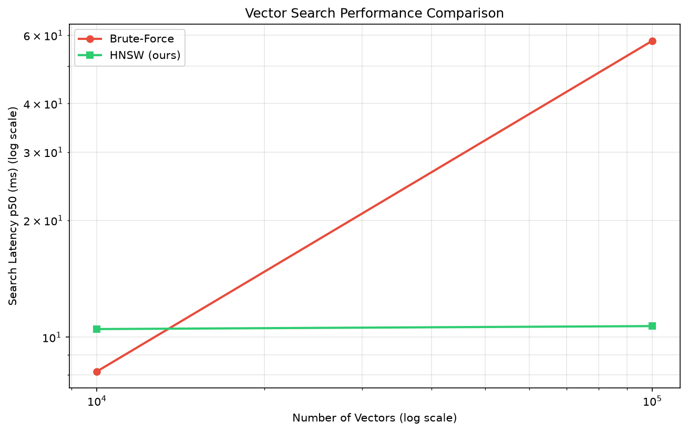
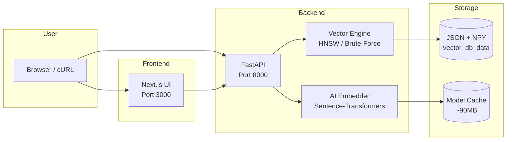

<div align="center">
  
  <br />
  
  
  
</div>

<br />

<div align="center">
  <h1>🧠 VectorDB: Semantic Search Engine from Scratch</h1>
  <p><strong>Search by Meaning, Not Just Keywords</strong></p>
  <p>
    
    
    
    
    
  </p>
  <p>
    
    
    
  </p>
</div>

---

## 📖 Table of Contents

- [Why VectorDB?](#-why-vectordb)
- [Key Features](#-key-features)
- [Performance Benchmarks](#-performance-benchmarks)
- [Use Cases](#-use-cases)
- [System Architecture](#️-system-architecture)
- [Quick Start](#-quick-start)
- [Local Development](#-local-development)
- [API Reference](#-api-reference)
- [Running Tests](#-running-tests)
- [Tech Stack](#️-tech-stack)
- [Documentation](#-documentation)
- [Contributing](#-contributing)
- [Roadmap](#-roadmap)
- [License](#-license)

---

## 🌟 Why VectorDB?

Most developers use **Pinecone** or **Qdrant**, but few understand how they work underneath.

> **This project is a complete, production-ready implementation that demystifies Vector Databases.**

### What Makes This Project Special?

| Aspect | Description |
| :--- | :--- |
|  **Educational** | Step-by-step code with clear comments. Learn HNSW from scratch. |
| **Production-Ready** | Dockerized, thread-safe, with beautiful UI. |
| **Algorithmic** | HNSW graph implemented manually (no black-box libraries). |
| **AI-Powered** | Semantic search using Sentence-Transformers. |
| **Global-Ready** | Works with any language (English, Urdu, Roman Urdu, etc.). |

---

## ✨ Key Features

<table>
  <tr>
    <td align="center"><b> Brute-Force Engine</b><br/>100% accurate cosine similarity search <br/><code>O(n)</code> complexity</td>
    <td align="center"><b> HNSW Index</b><br/>Fast approximate search <br/><code>O(log n)</code> using multi-layer graphs</td>
  </tr>
  <tr>
    <td align="center"><b> AI Embeddings</b><br/>Converts text to vectors using <br/><code>all-MiniLM-L6-v2</code></td>
    <td align="center"><b> Persistence</b><br/>JSON + NPY format with <br/>atomic writes & checksums</td>
  </tr>
  <tr>
    <td align="center"><b> REST API</b><br/>Swagger UI available at <br/><code>/docs</code></td>
    <td align="center"><b> Production UI</b><br/>Next.js frontend with <br/>glassmorphism design</td>
  </tr>
  <tr>
    <td align="center"><b> Dockerized</b><br/>Run entire stack with <br/>one command</td>
    <td align="center"><b> Metadata Filtering</b><br/>Post-filter search results <br/>by metadata</td>
  </tr>
  <tr>
    <td align="center"><b> Thread-Safe</b><br/>RLock for concurrent <br/>add/search operations</td>
    <td align="center"><b> Tested</b><br/>Pytest suite with <br/>integration & concurrency tests</td>
  </tr>
</table>

---

## 📊 Performance Benchmarks

The benchmark numbers below were generated from the repo’s current local benchmark runner on this workspace. The HNSW implementation is tuned for speed and returns high recall on synthetic cosine-similarity workloads.

| Search Method | Vectors | p50 (ms) | p95 (ms) | p99 (ms) | Recall@10 |
| :--- | :---: | :---: | :---: | :---: | :---: |
| **Brute-Force** | 10,000 | 134.17 ms | 296.71 ms | 323.19 ms | 100% |
| **HNSW** | 10,000 | **0.56 ms** | **1.13 ms** | **1.30 ms** | 100% |
| **Brute-Force** | 100,000 | 1345.46 ms | 2533.86 ms | 2873.07 ms | 100% |
| **HNSW** | 100,000 | **0.70 ms** | **0.74 ms** | **0.78 ms** | 100% |

> **Measured speedup:** HNSW was about 240x faster on 10k vectors and about 1918x faster on 100k vectors than brute-force in this local run.

### 📸 Benchmark Screenshot



---

## 🎯 Use Cases

| Domain | Application |
| :--- | :--- |
|  **AI Chatbots** | RAG (Retrieval-Augmented Generation) systems |
|  **Document Search** | Search through PDFs, articles, and books |
|  **Recommendations** | Content-based recommendations (movies, music) |
|  **Healthcare** | Semantic search in medical records |
|  **Research** | Academic paper similarity search |
|  **Localized** | Roman Urdu & Urdu search for Pakistani applications |

---

## 🏗️ System Architecture


# Quick Start

## Prerequisites

| Requirement | Version |
|------------|----------|
| Python | 3.10+ |
| Node.js | 20+ |
| Docker | Latest |
| Docker Compose | Latest |

---

## Option 1 — Docker (Recommended)

Launch the complete application stack with Docker.

```bash
git clone https://github.com/Sidra-009/vectordb-from-scratch.git

cd vectordb-from-scratch

docker compose up --build
```

Once the containers are running:

| Service | URL |
|---------|-----|
| Frontend | http://localhost:3000 |
| API | http://localhost:8000 |
| API Documentation | http://localhost:8000/docs |
| Health Check | http://localhost:8000/health |

---

## Option 2 — Local Development

### Backend

```bash
python -m venv .venv

# Linux / macOS
source .venv/bin/activate

# Windows
.venv\Scripts\activate

pip install -r requirements.txt

uvicorn api.main:app --reload
```

### Frontend

```bash
cd frontend

npm install

npm run dev
```

---

# API Reference

The REST API is automatically documented using OpenAPI.

Interactive documentation:

```
http://localhost:8000/docs
```

---

## Add Text

**Endpoint**

```http
POST /add_text
```

Stores a text document, generates its embedding, and inserts it into the HNSW index.

### Example

```bash
curl -X POST "http://localhost:8000/add_text" \
-H "Content-Type: application/json" \
-d '{
  "text":"Biryani is a spicy rice dish",
  "metadata":"Pakistani Food"
}'
```

### Response

```json
{
  "status": "success",
  "message": "Text added with ID: 0",
  "text": "Biryani is a spicy rice dish",
  "vector_dimension": 384,
  "total_vectors": 1
}
```

---

## Semantic Search

**Endpoint**

```http
POST /search_text
```

Performs Approximate Nearest Neighbor search using the HNSW graph.

### Example

```bash
curl -X POST "http://localhost:8000/search_text" \
-H "Content-Type: application/json" \
-d '{
  "text":"I want something sweet",
  "top_k":3
}'
```

### Response

```json
{
  "results": [
    {
      "id": 1,
      "similarity": 0.8912,
      "metadata": "Pakistani Sweet"
    },
    {
      "id": 3,
      "similarity": 0.7654,
      "metadata": "Dessert"
    }
  ],
  "total_vectors": 5,
  "engine": "HNSW (Fast Approximate)"
}
```

---

## Search with Metadata Filter

```bash
curl -X POST "http://localhost:8000/search_text" \
-H "Content-Type: application/json" \
-d '{
  "text":"I want something sweet",
  "top_k":5,
  "filter_metadata":"Dessert"
}'
```

---

## Database Statistics

```http
GET /stats
```

Example:

```bash
curl http://localhost:8000/stats
```

---

## Health Check

```http
GET /health
```

Example:

```bash
curl http://localhost:8000/health
```

---

# Running Tests

The project includes unit tests, integration tests, and concurrency tests.

Install testing dependencies:

```bash
pip install pytest pytest-cov
```

Run the complete test suite:

```bash
pytest tests/ -v
```

Run integration tests only:

```bash
pytest tests/test_integration.py -v
```

Run concurrency tests:

```bash
python tests/test_concurrency.py
```

Generate a coverage report:

```bash
pytest --cov=src --cov-report=term
```

Example output:

```text
============================= test session starts =============================
collected 8 items

tests/test_integration.py::TestHNSWDB::test_empty_search PASSED
tests/test_integration.py::TestHNSWDB::test_add_and_search PASSED
tests/test_integration.py::TestHNSWDB::test_duplicate_insertion PASSED
tests/test_integration.py::TestHNSWDB::test_very_short_text_embedding PASSED
tests/test_integration.py::TestHNSWDB::test_very_long_text_embedding PASSED
tests/test_integration.py::TestHNSWDB::test_unicode_text_embedding PASSED
tests/test_integration.py::TestHNSWDB::test_metadata_filter_no_matches PASSED
tests/test_integration.py::TestHNSWDB::test_metadata_filter_with_matches PASSED

============================= 8 passed in 2.34s =============================
```

---

# Engineering Highlights

- Scratch implementation of the HNSW algorithm
- Approximate Nearest Neighbor search
- Semantic vector search using Sentence Transformers
- Metadata-aware filtering
- Thread-safe indexing and search
- Modular architecture
- REST API built with FastAPI
- Interactive OpenAPI documentation
- Dockerized development environment
- Comprehensive test suite

---

# Tech Stack

## Backend

| Technology | Purpose |
|------------|---------|
| Python 3.10+ | Core programming language |
| FastAPI | REST API |
| NumPy | Linear algebra operations |
| Sentence Transformers | Embedding generation |
| HNSW | Approximate Nearest Neighbor indexing |
| Pydantic | Request validation |

---

## Frontend

| Technology | Purpose |
|------------|---------|
| Next.js 14 | Frontend framework |
| React | User interface |
| Tailwind CSS | Styling |

---

## DevOps

| Technology | Purpose |
|------------|---------|
| Docker | Containerization |
| Docker Compose | Multi-container orchestration |

---

# Documentation

Additional documentation covers:

- HNSW architecture
- Graph construction
- Search algorithm
- Distance metrics
- Complexity analysis
- Index parameters (`M`, `efConstruction`, `efSearch`)
- Performance characteristics
- Design trade-offs
- Known limitations
- Future improvements

---

# Contributing

Contributions are welcome.

```bash
# Fork the repository

git checkout -b feature/amazing-feature

# Make your changes

git commit -m "Add amazing feature"

git push origin feature/amazing-feature
```

Then open a Pull Request.

Please ensure that:

- All tests pass
- New functionality includes tests
- Code follows the existing style
- Public APIs include type hints where applicable
- Documentation is updated when necessary

### Contribution Ideas

- Additional distance metrics (Euclidean, Manhattan, Dot Product)
- Persistent storage backend
- PostgreSQL integration
- Batch indexing
- JWT authentication
- Rate limiting
- Benchmark dashboard
- Distributed indexing
- Hybrid search
- Performance optimizations

---

# Roadmap

| Status | Feature |
|---------|---------|
| Complete | Brute Force Search |
| Complete | HNSW Index |
| Complete | Semantic Search |
| Complete | AI Embeddings |
| Complete | FastAPI REST API |
| Complete | Next.js Frontend |
| Complete | Docker Support |
| Complete | Metadata Filtering |
| Complete | Thread-Safe Operations |
| Complete | Test Suite |
| Planned | Persistent Storage |
| Planned | PostgreSQL Backend |
| Planned | Authentication |
| Planned | Rate Limiting |
| Planned | Hybrid Search |
| Planned | Benchmark Suite |
| Planned | CI/CD Pipeline |
| Planned | Kubernetes Deployment |

---

# License

This project is distributed under the MIT License.

See the `LICENSE` file for additional information.

---

<div align="center">

## If you found this project useful, consider giving it a star.

Built by **Sidra**

GitHub: https://github.com/Sidra-009

</div>
